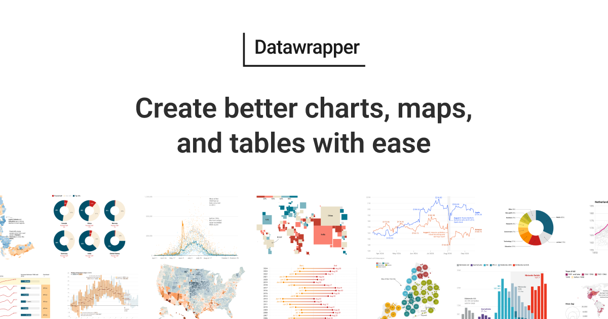

## Summary
Create interactive, responsive & beautiful data visualizations with the online tool Datawrapper — no code required.

## Key Details
- **Source:** [datawrapper.de](https://www.datawrapper.de/)
- **Title:** Datawrapper: Create charts, maps, and tables
- **Description:** Create interactive, responsive & beautiful data visualizations with the online tool Datawrapper — no code required.

## Visual Assets

