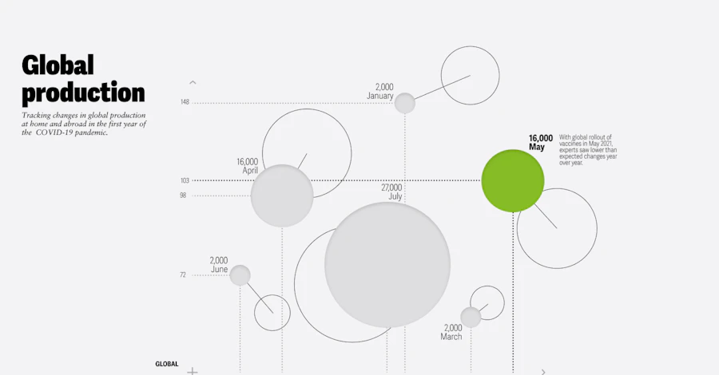

## Summary
Data visualizations for the business publication from one of the world’s largest professional services firms.

## Key Details
- **Source:** [pentagram.com](https://www.pentagram.com/work/deloitte-insights?rel=sector&rel-id=23#37258)
- **Title:** ‘Deloitte Insights’
- **Description:** Data visualizations for the business publication from one of the world’s largest professional services firms.

## Visual Assets

