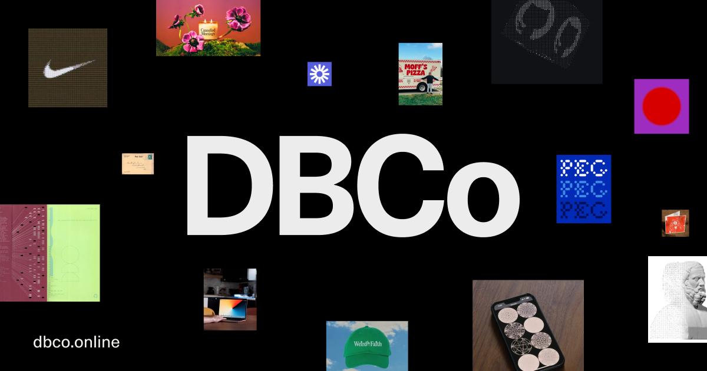

## Summary
DBCo is a design and technology studio engineering brands, software, websites, and digital experiences. We integrate design with emerging technology to develop intuitive, scalable brand systems and ap

## Key Details
- **Source:** [dbco.online](https://dbco.online/?ref=designerdailyreport.com)
- **Title:** Design Business Company
- **Description:** DBCo is a design and technology studio engineering brands, software, websites, and digital experiences. We integrate design with emerging technology t

## Visual Assets

