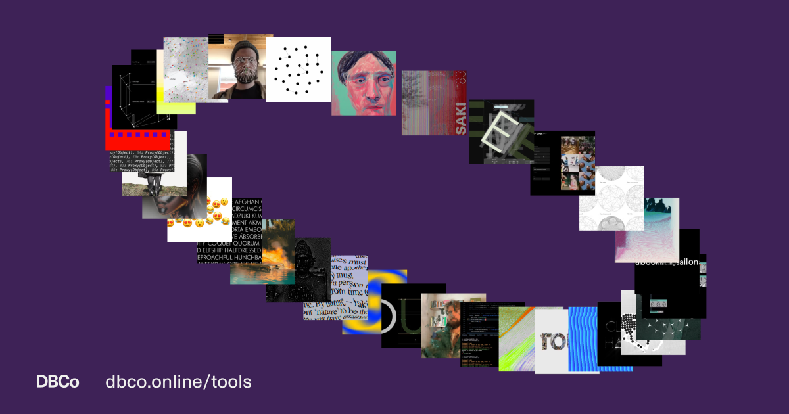

## Summary
We build scalable brand systems powered by design, tech, and AI—tools that help teams move faster, stay on-brand, and create what’s next.

## Key Details
- **Source:** [dbco.online](https://dbco.online/tools/)
- **Title:** Design Business Company • Tools
- **Description:** We build scalable brand systems powered by design, tech, and AI—tools that help teams move faster, stay on-brand, and create what’s next.

## Visual Assets

