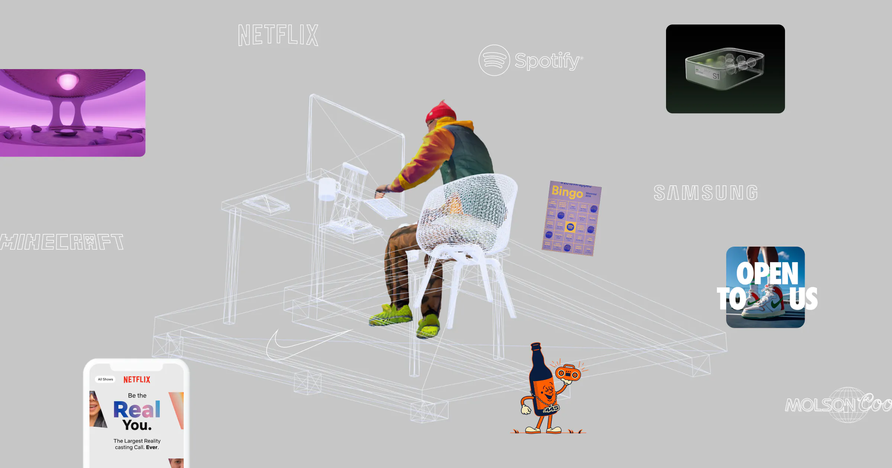

## Summary
A multi-faceted designer and creative director, R—C is constantly trying to connect culture, technology and design. An optimist of the future, creating the products and experiences of tomorrow is what

## Key Details
- **Source:** [r-c.work](https://r-c.work/?ref=landing.love)
- **Title:** Design & Direction
- **Description:** A multi-faceted designer and creative director, R—C is constantly trying to connect culture, technology and design. An optimist of the future, creatin

## Visual Assets

