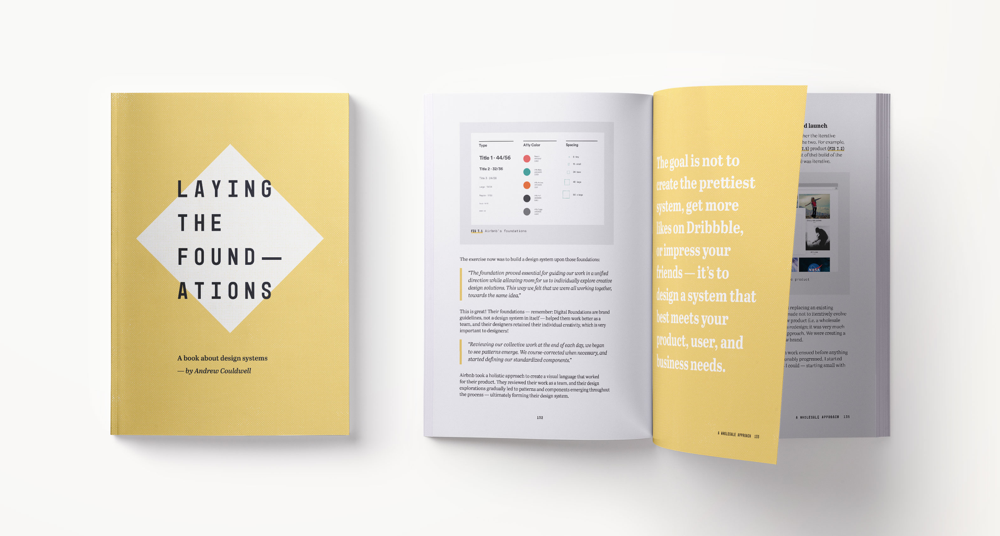

## Summary
Supporting material for the book, Laying the Foundations — linking to useful design system resources, tools, documentation, examples, books, and articles.

## Key Details
- **Source:** [designsystemfoundations.com](https://designsystemfoundations.com/design-system-resources/)
- **Title:** Design system resources
- **Description:** Supporting material for the book, Laying the Foundations — linking to useful design system resources, tools, documentation, examples, books, and artic

## Visual Assets

