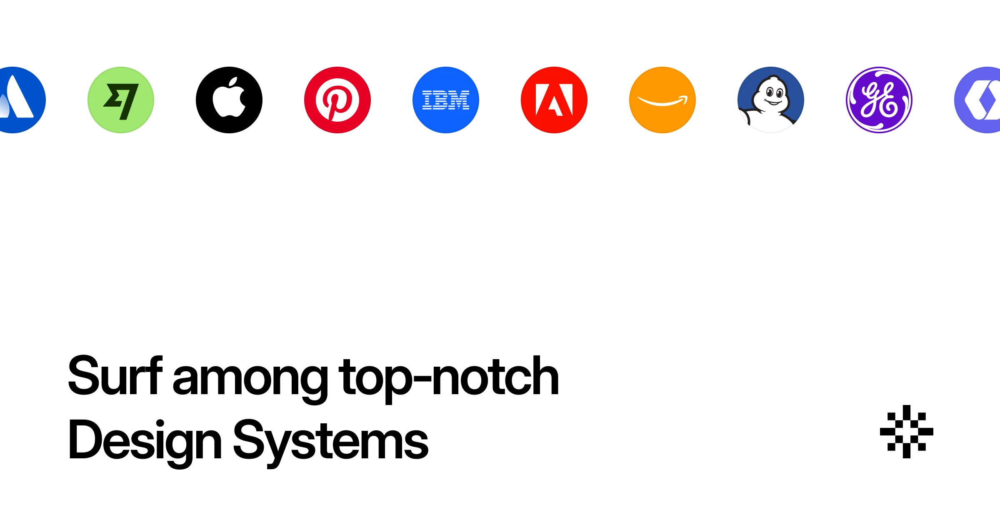

## Summary
Best-in-class Design Systems collection with a repository of Components and Foundations references from top-tier tech companies and leading UI teams.

## Key Details
- **Source:** [designsystems.surf](https://designsystems.surf/)
- **Title:** Design Systems Database & Gallery
- **Description:** Best-in-class Design Systems collection with a repository of Components and Foundations references from top-tier tech companies and leading UI teams.

## Visual Assets

