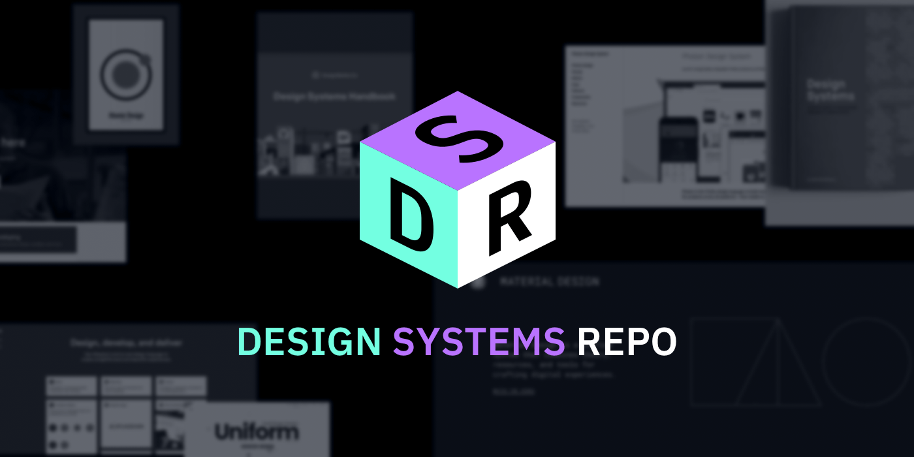

## Summary
An organized and frequently updated collection of Design System examples, resources, tools, articles and videos.

## Key Details
- **Source:** [designsystemsrepo.com](https://designsystemsrepo.com/design-systems/)
- **Title:** Design Systems Repo
- **Description:** An organized and frequently updated collection of Design System examples, resources, tools, articles and videos.

## Visual Assets

