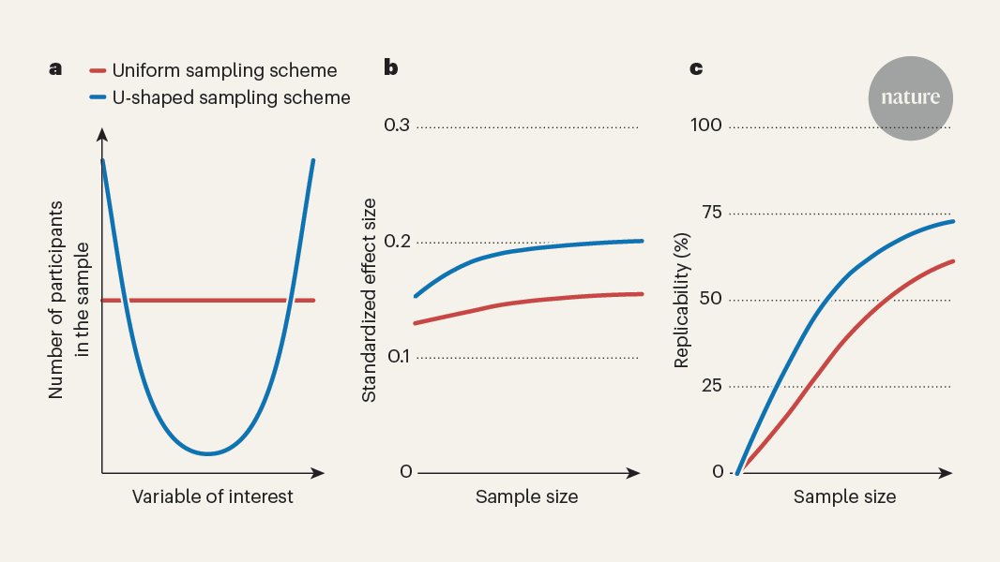

## Summary
Sampling schemes for reproducible brain-wide association studies.

## Key Details
- **Source:** [nature.com](https://www.nature.com/articles/d41586-024-03650-5)
- **Title:** Design tips for reproducible studies linking the brain to behaviour
- **Description:** Sampling schemes for reproducible brain-wide association studies.

## Visual Assets

