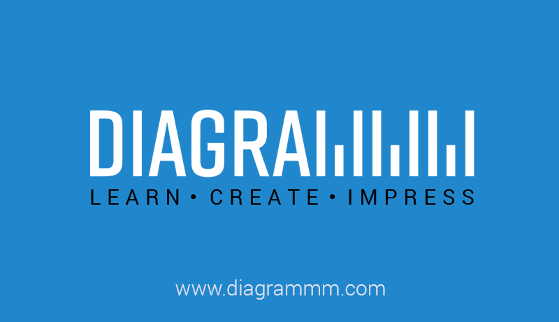

## Summary
Data Visualization Grammar

## Key Details
- **Source:** [diagrammm.com](http://diagrammm.com/?ref=producthunt)
- **Title:** Diagrammm
- **Description:** Data Visualization Grammar

## Visual Assets

