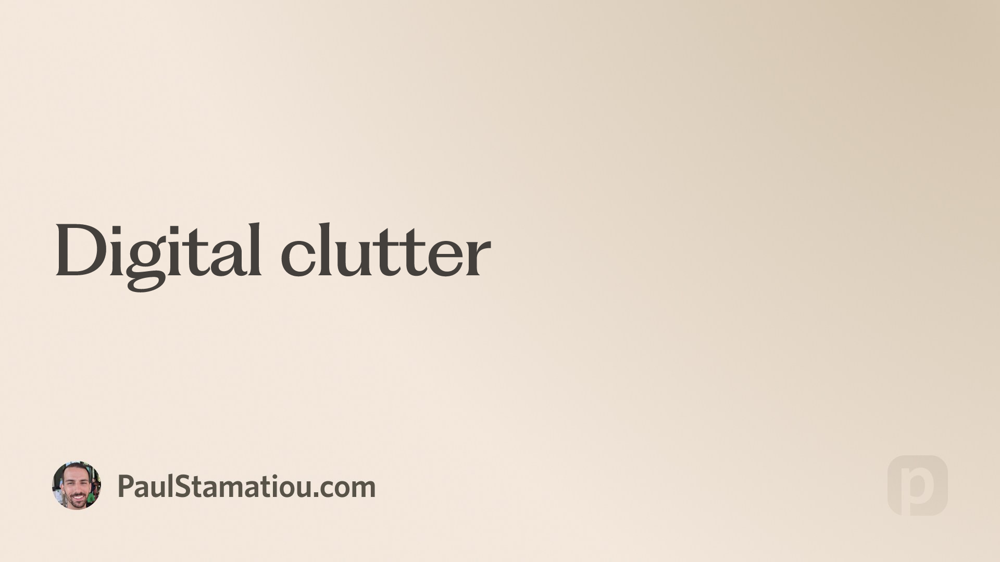

## Summary
Learning to let go and stop hoarding terabytes: Sharing my journey of downsizing my digital storage, letting go of terabytes of data, and moving away from a NAS setup. I decided to use an external Thu

## Key Details
- **Source:** [paulstamatiou.com](https://paulstamatiou.com/digital-clutter)
- **Title:** Digital clutter
- **Description:** Learning to let go and stop hoarding terabytes: Sharing my journey of downsizing my digital storage, letting go of terabytes of data, and moving away 

## Visual Assets

