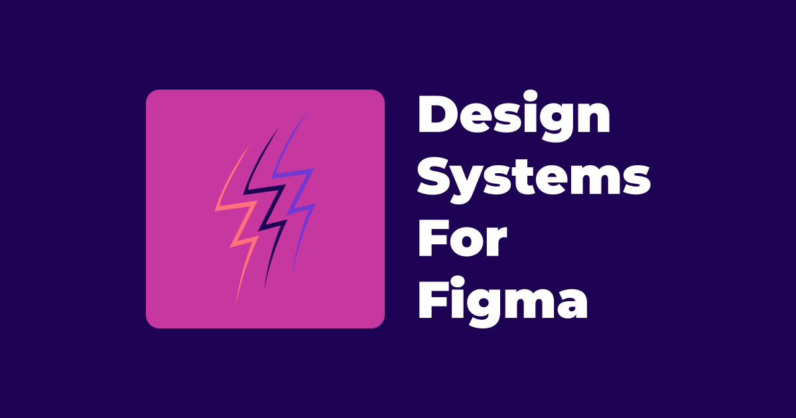

## Summary
Discover expert insights and tools to create, manage, and scale design systems with Figma. Access real-world case studies, best practices, and tips from industry leaders to elevate your design process

## Key Details
- **Source:** [designsystemsforfigma.com](https://www.designsystemsforfigma.com/)
- **Title:** Discover expert insights and tools to create, manage, and scale design systems with Figma. Access real-world case studies, best practices, and tips from industry leaders to elevate your design process and achieve consistent, user-centered results.
- **Description:** Discover expert insights and tools to create, manage, and scale design systems with Figma. Access real-world case studies, best practices, and tips fr

## Visual Assets

