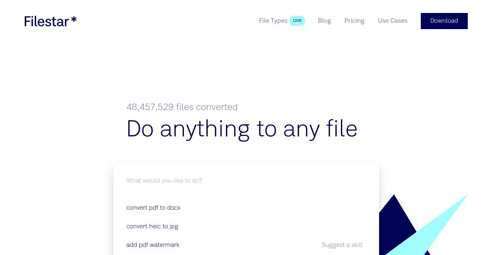

## Summary
Convert, compress, split, merge, and transform over 400 different file types. Work with images, documents, audio, video and more.

## Key Details
- **Source:** [filestar.com](https://filestar.com/)
- **Title:** Do anything to any file
- **Description:** Convert, compress, split, merge, and transform over 400 different file types. Work with images, documents, audio, video and more.

## Visual Assets

