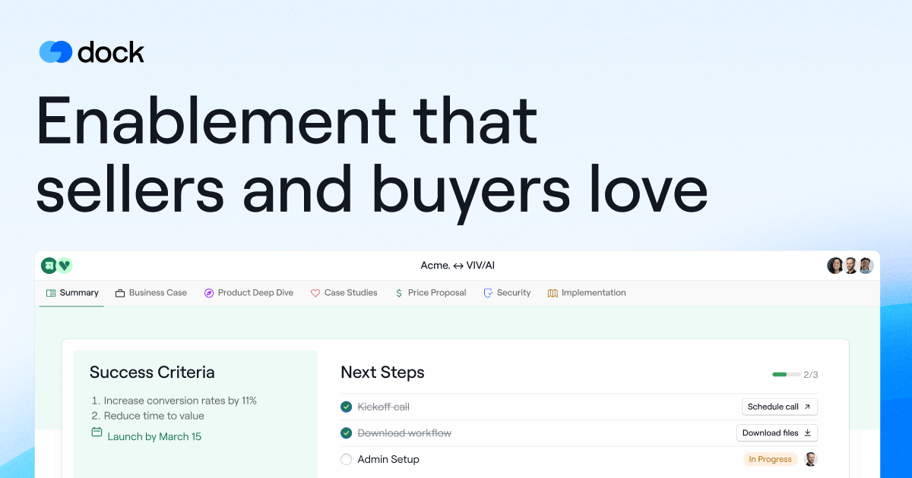

## Summary
Dock is the Al revenue enablement platform built for the way people buy today. Collaborate with customers, share content, and enable reps in real time.

## Key Details
- **Source:** [dock.us](https://www.dock.us/)
- **Title:** Dock is the Al revenue enablement platform built for the way people buy today. Collaborate with customers, share content, and enable reps in real time.
- **Description:** Dock is the Al revenue enablement platform built for the way people buy today. Collaborate with customers, share content, and enable reps in real time

## Visual Assets

