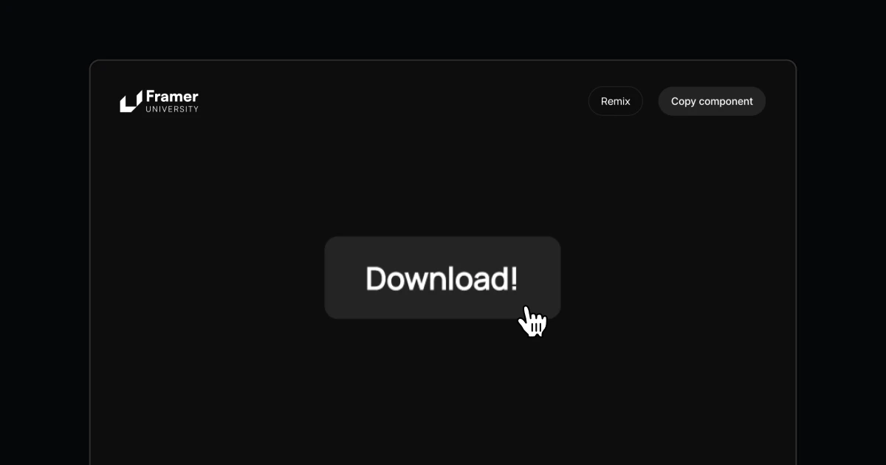

## Summary
Free Download Button component for Framer. Created by Nandor Muzsik - Framer University.

## Key Details
- **Source:** [download.learnframer.site](https://download.learnframer.site/)
- **Title:** Download Button by Framer University
- **Description:** Free Download Button component for Framer. Created by Nandor Muzsik - Framer University.

## Visual Assets

