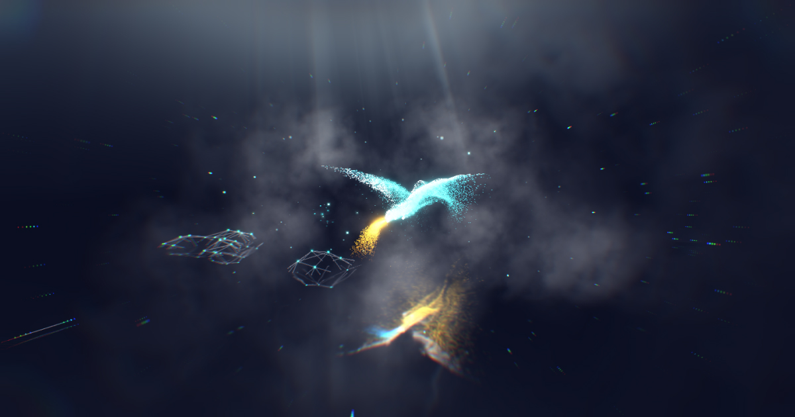

## Summary
Dracarys, a experimental WebGL experiment by Robert Borghesi on GPGPU animations and postprocessing effects

## Key Details
- **Source:** [dracarys.robertborghesi.is](https://dracarys.robertborghesi.is/)
- **Title:** Dracarys - Robert Borghesi LAB
- **Description:** Dracarys, a experimental WebGL experiment by Robert Borghesi on GPGPU animations and postprocessing effects

## Visual Assets

