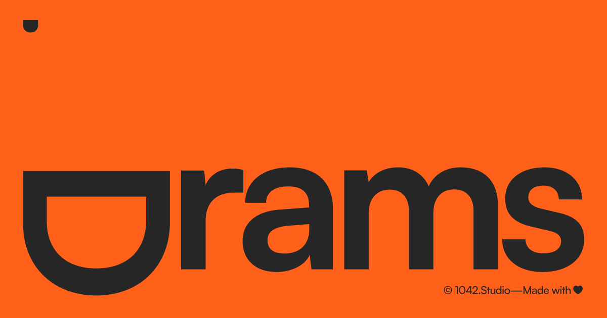

## Summary
Elevate your digital projects with sleek Framer UI elements inspired by Dieter Rams. Explore buttons, sliders & components designed for simplicity & functionality.

## Key Details
- **Source:** [drams.framer.website](https://drams.framer.website/)
- **Title:** Drams - Framer components inspired by Dieter Rams
- **Description:** Elevate your digital projects with sleek Framer UI elements inspired by Dieter Rams. Explore buttons, sliders & components designed for simplicity & f

## Visual Assets

