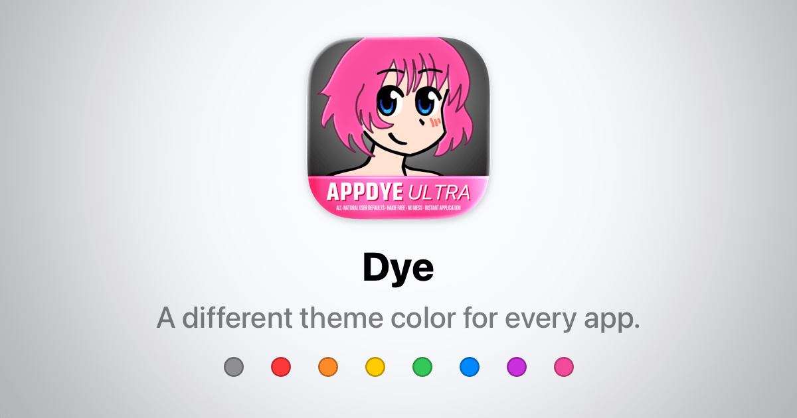

## Summary
A different theme color for every app.

## Key Details
- **Source:** [lemon.garden](https://lemon.garden/dye/)
- **Title:** Dye
- **Description:** A different theme color for every app.

## Visual Assets

