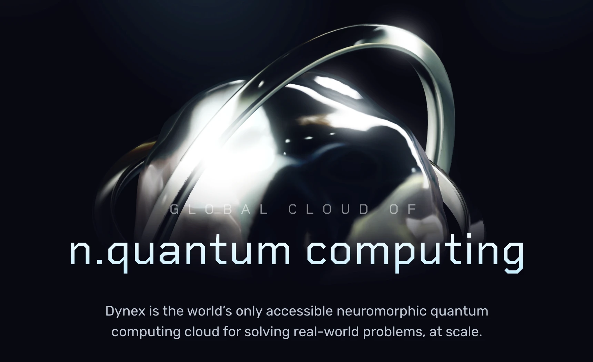

## Summary
Dynex is the world’s only accessible neuromorphic quantum computing cloud for solving real-world problems, at scale.

## Key Details
- **Source:** [dynexcoin.org](https://dynexcoin.org/)
- **Title:** Dynex
- **Description:** Dynex is the world’s only accessible neuromorphic quantum computing cloud for solving real-world problems, at scale.

## Visual Assets

