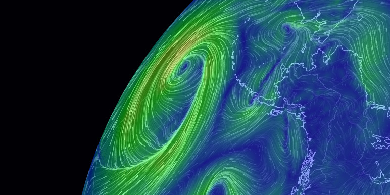

## Summary
See current wind, weather, ocean, and pollution conditions, as forecast by supercomputers, on an interactive animated map. Updated every three hours.

## Key Details
- **Source:** [earth.nullschool.net](https://earth.nullschool.net/)
- **Title:** earth :: a global map of wind, weather, and ocean conditions
- **Description:** See current wind, weather, ocean, and pollution conditions, as forecast by supercomputers, on an interactive animated map. Updated every three hours.

## Visual Assets

