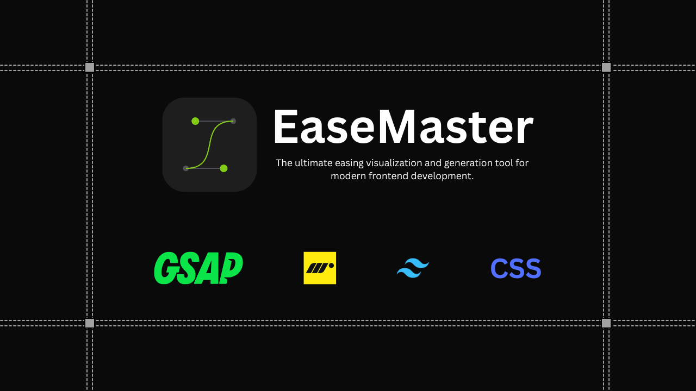

## Summary
Generate production-ready code for CSS, Tailwind, Framer Motion, and GSAP. Visualize Bezier curves and Spring physics side-by-side.

## Key Details
- **Source:** [easemaster.satisui.xyz](https://easemaster.satisui.xyz/)
- **Title:** EaseMaster | Design Motion That Feels Real
- **Description:** Generate production-ready code for CSS, Tailwind, Framer Motion, and GSAP. Visualize Bezier curves and Spring physics side-by-side.

## Visual Assets

