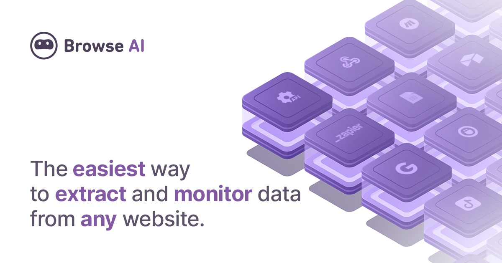

## Summary
Easily scrape web data, monitor webpage changes, and turn websites into APIs with Browse AI.

## Key Details
- **Source:** [browse.ai](https://www.browse.ai/)
- **Title:** Easily scrape web data, monitor webpage changes, and turn websites into APIs with Browse AI.
- **Description:** Easily scrape web data, monitor webpage changes, and turn websites into APIs with Browse AI.

## Visual Assets

