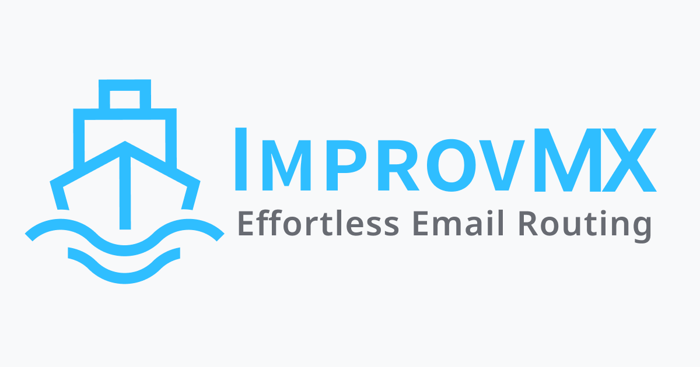

## Summary
Easily send and receive emails on your domain. Fast setup, privacy-first, supports regexes, wildcards, webhooks, and an API.

## Key Details
- **Source:** [improvmx.com](https://improvmx.com/)
- **Title:** Easily send and receive emails on your domain. Fast setup, privacy-first, supports regexes, wildcards, webhooks, and an API.
- **Description:** Easily send and receive emails on your domain. Fast setup, privacy-first, supports regexes, wildcards, webhooks, and an API.

## Visual Assets

