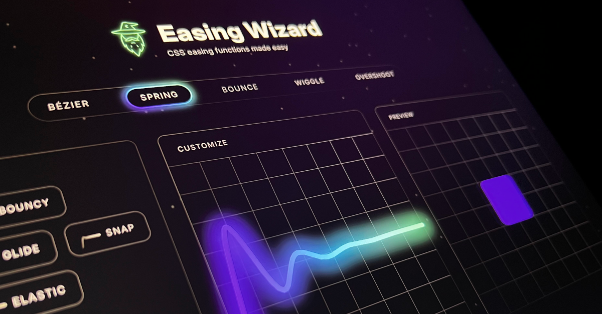

## Summary
Generate and customize CSS easing functions with ease and magical precision using Easing Wizard 🧙

## Key Details
- **Source:** [easingwizard.com](https://easingwizard.com/)
- **Title:** Easing Wizard - CSS Easing Editor and Generator
- **Description:** Generate and customize CSS easing functions with ease and magical precision using Easing Wizard 🧙

## Visual Assets

