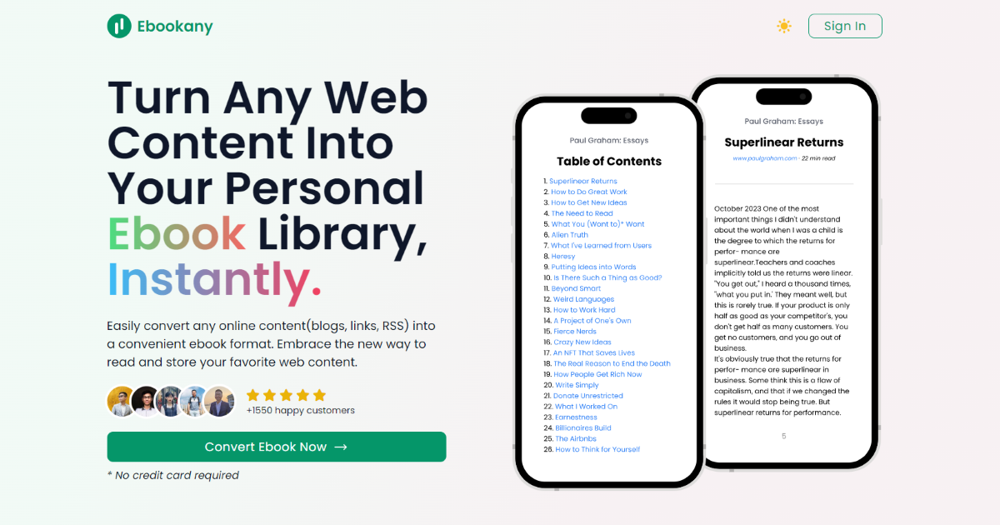

## Summary
Easily convert blogs, links, RSS feeds, YouTube videos, Google Docs, and Notion pages into beautifully formatted EPUB and PDF ebooks.

## Key Details
- **Source:** [ebookany.com](https://ebookany.com/?utm_source=DenseDiscovery-304)
- **Title:** Ebookany - Turn Any Web Content Into Your Personal Ebook Library, Instantly
- **Description:** Easily convert blogs, links, RSS feeds, YouTube videos, Google Docs, and Notion pages into beautifully formatted EPUB and PDF ebooks.

## Visual Assets

