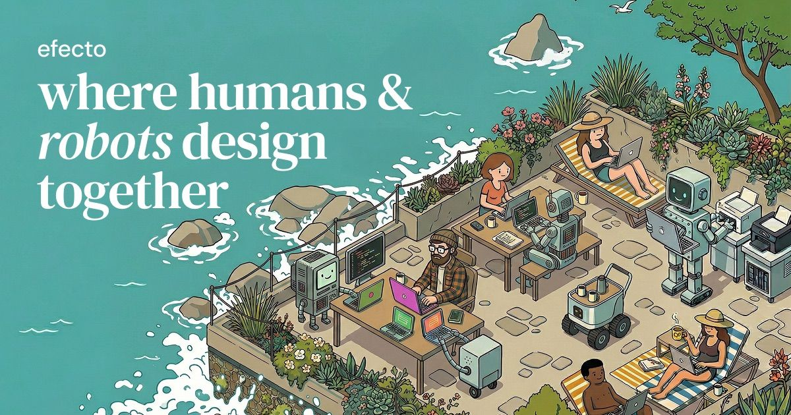

## Summary
The design tool where AI agents are first-class. Artboards, layers, auto-layout, 65 MCP tools. Free.

## Key Details
- **Source:** [efecto.app](https://efecto.app/)
- **Title:** Efecto — Where Humans & Robots Design Together
- **Description:** The design tool where AI agents are first-class. Artboards, layers, auto-layout, 65 MCP tools. Free.

## Visual Assets

