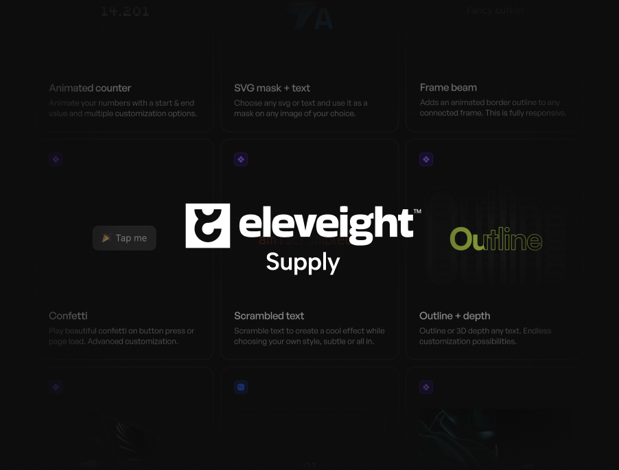

## Summary
Elevate your projects with our premium library of Framer code components, plugins, remixes, and templates, perfect for creators aiming to elevate their work with the best tools and resources available

## Key Details
- **Source:** [eleveight.supply](https://www.eleveight.supply/)
- **Title:** Eleveight Supply
- **Description:** Elevate your projects with our premium library of Framer code components, plugins, remixes, and templates, perfect for creators aiming to elevate thei

## Visual Assets

