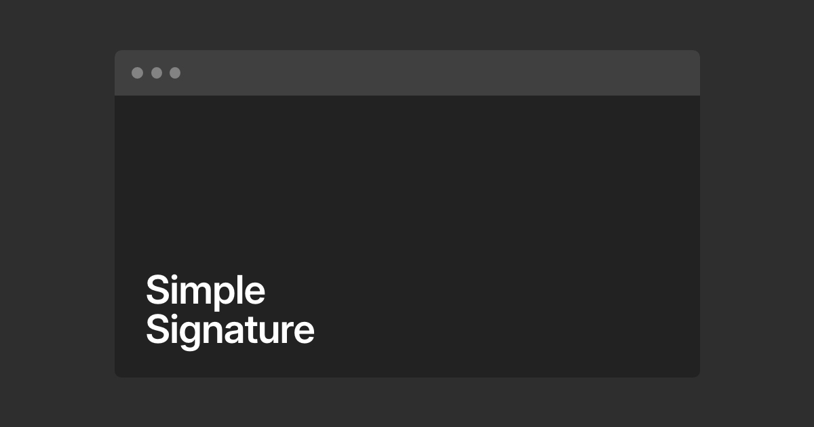

## Summary
Minimal Email Signature Editor for signatures that work everywhere. One image, no font chaos, no extras.

## Key Details
- **Source:** [simplesignature.email](https://simplesignature.email/signature-editor/)
- **Title:** Email Signature Editor – simplesignature.email
- **Description:** Minimal Email Signature Editor for signatures that work everywhere. One image, no font chaos, no extras.

## Visual Assets

