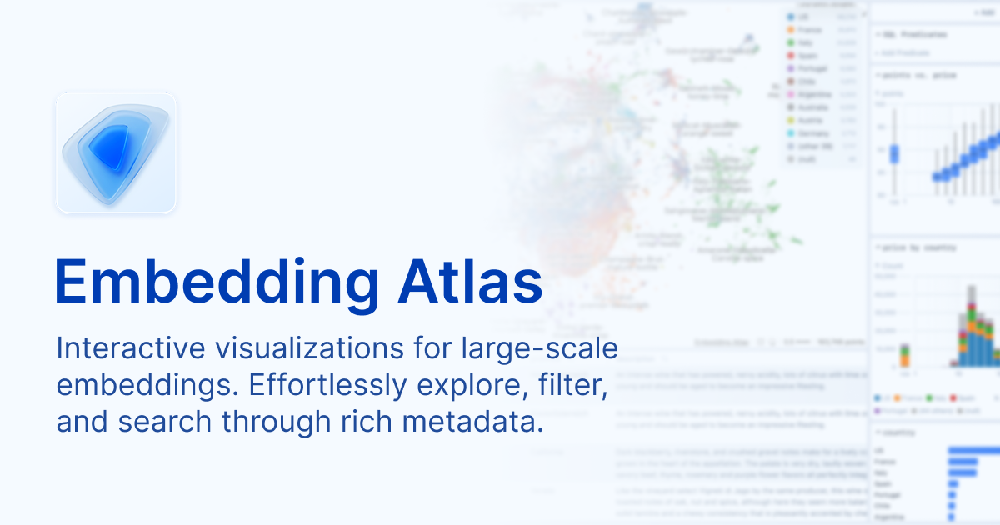

## Summary
Interactive visualizations for large-scale embeddings. Effortlessly explore, filter, and search through rich metadata.

## Key Details
- **Source:** [apple.github.io](https://apple.github.io/embedding-atlas/)
- **Title:** Embedding Atlas
- **Description:** Interactive visualizations for large-scale embeddings. Effortlessly explore, filter, and search through rich metadata.

## Visual Assets

