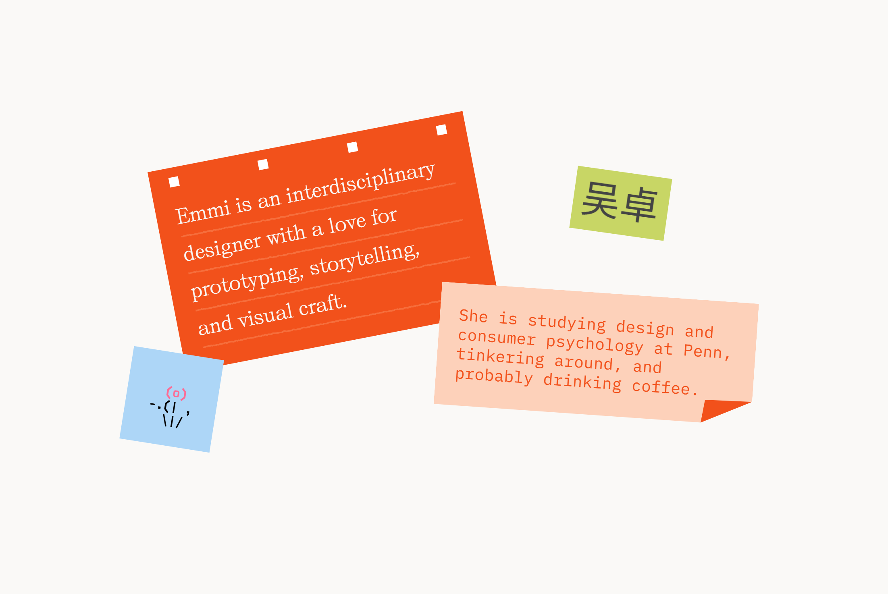

## Summary
Emmi is an interdisciplinary designer with a love for prototyping, storytelling, and visual craft. She

## Key Details
- **Source:** [emmiwu.com](https://emmiwu.com/)
- **Title:** Emmi Wu Portfolio
- **Description:** Emmi is an interdisciplinary designer with a love for prototyping, storytelling, and visual craft. She

## Visual Assets

