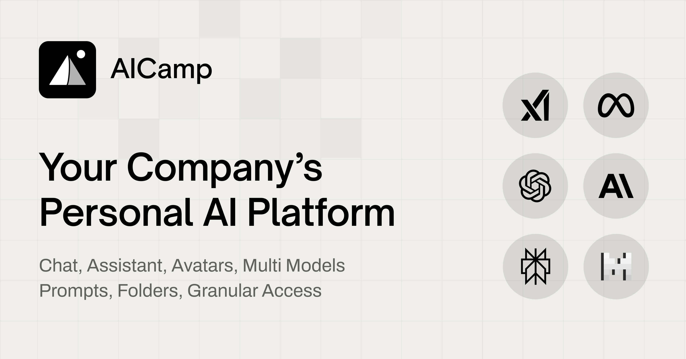

## Summary
Enterprise ready AI platform to roll out AI across your company. Empower employees and teams to build secure, custom AI workflows and scale AI adoption with control.

## Key Details
- **Source:** [aicamp.so](https://aicamp.so/)
- **Title:** Enterprise AI Platform for Your Company | AICamp
- **Description:** Enterprise ready AI platform to roll out AI across your company. Empower employees and teams to build secure, custom AI workflows and scale AI adoptio

## Visual Assets

