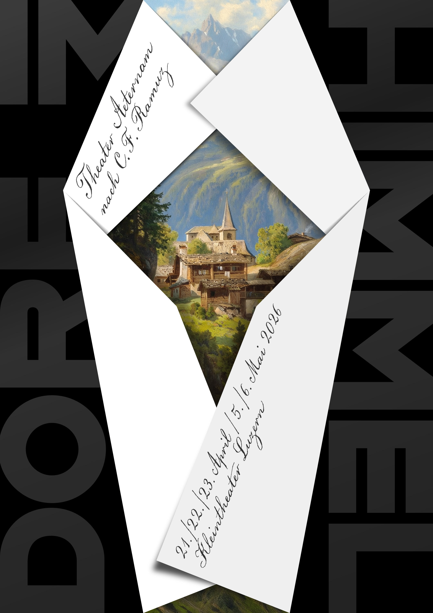

## Summary
Erich Brechbühl [Mixer] is a Lucerne based independent graphic designer focused on poster and corporate design.

## Key Details
- **Source:** [erichbrechbuhl.ch](https://erichbrechbuhl.ch/all)
- **Title:** Erich Brechbühl [Mixer]
- **Description:** Erich Brechbühl [Mixer] is a Lucerne based independent graphic designer focused on poster and corporate design.

## Visual Assets

