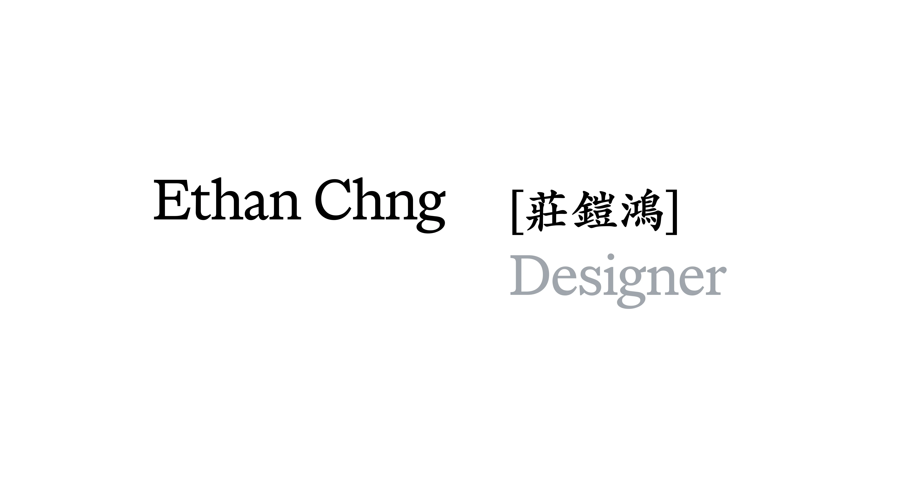

## Summary
Ethan [鎧鴻] is a designer and artist who loves gesture-driven spatial systems and creative tooling. He enjoys dreaming up ambitious novel toys that solve complex problems in creative ways. Previously a

## Key Details
- **Source:** [ethanchng.com](https://www.ethanchng.com/)
- **Title:** Ethan Chng Design
- **Description:** Ethan [鎧鴻] is a designer and artist who loves gesture-driven spatial systems and creative tooling. He enjoys dreaming up ambitious novel toys that sol

## Visual Assets

