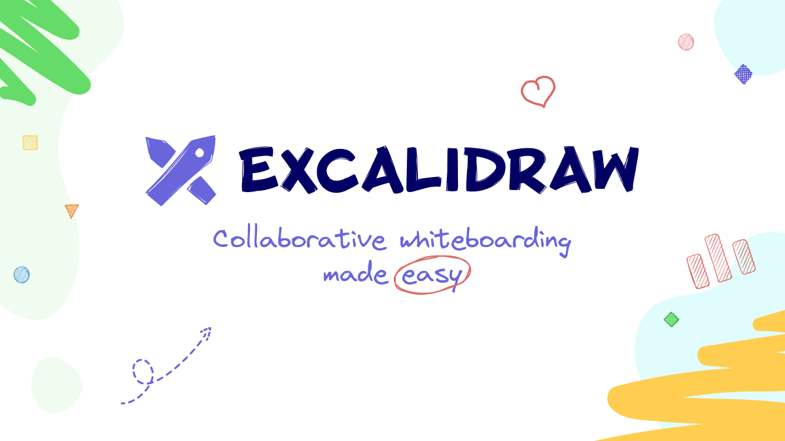

## Summary
Excalidraw is a virtual collaborative whiteboard tool that lets you easily sketch diagrams that have a hand-drawn feel to them.

## Key Details
- **Source:** [excalidraw.com](https://excalidraw.com/)
- **Title:** Excalidraw — Collaborative whiteboarding made easy
- **Description:** Excalidraw is a virtual collaborative whiteboard tool that lets you easily sketch diagrams that have a hand-drawn feel to them.

## Visual Assets

