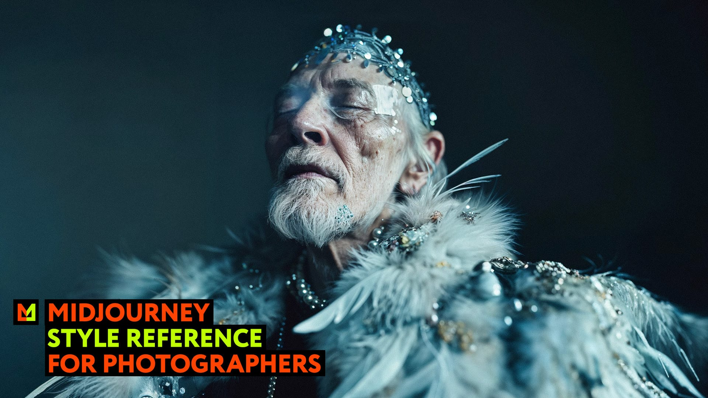

## Summary
Explore the application of Midjourney's Style Reference feature, which allows for the application of existing visual styles to new prompts within the domain of professional photography.

## Key Details
- **Source:** [midlibrary.io](https://midlibrary.io/midguide/midjourney-style-reference-sref-for-photographers)
- **Title:** Explore the application of Midjourney's Style Reference feature, which allows for the application of existing visual styles to new prompts within the domain of professional photography.
- **Description:** Explore the application of Midjourney's Style Reference feature, which allows for the application of existing visual styles to new prompts within the 

## Visual Assets

