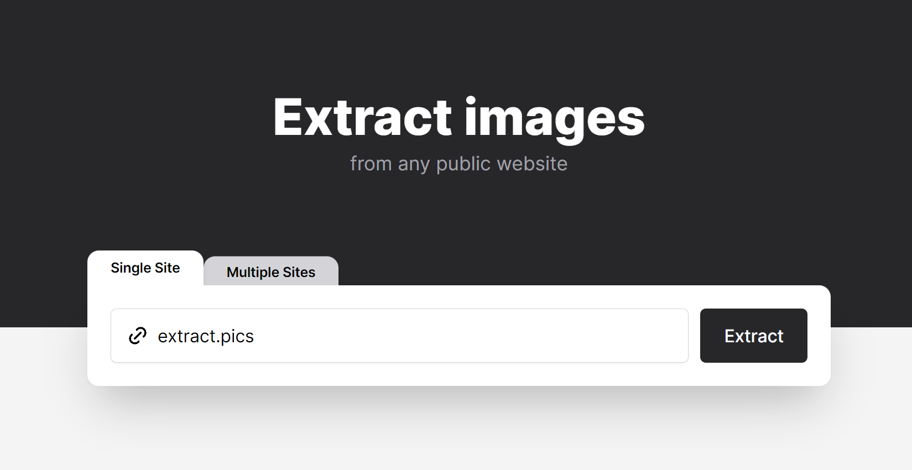

## Summary
extract.pics is a free tool to extract, view and download images from any public website by using a virtual browser. Now with an easy-to-use API.

## Key Details
- **Source:** [extract.pics](https://extract.pics/)
- **Title:** extract.pics
- **Description:** extract.pics is a free tool to extract, view and download images from any public website by using a virtual browser. Now with an easy-to-use API.

## Visual Assets

