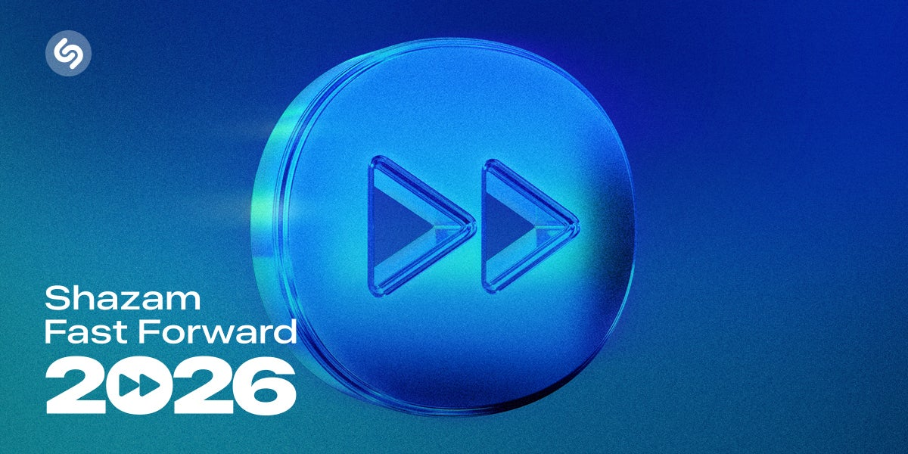

## Summary
Discover Shazam’s Predictions for breakthrough artists in 2026

## Key Details
- **Source:** [shazam.com](https://www.shazam.com/fastforward2025)
- **Title:** Fast Forward 2026: 65 Artists
- **Description:** Discover Shazam’s Predictions for breakthrough artists in 2026

## Visual Assets

