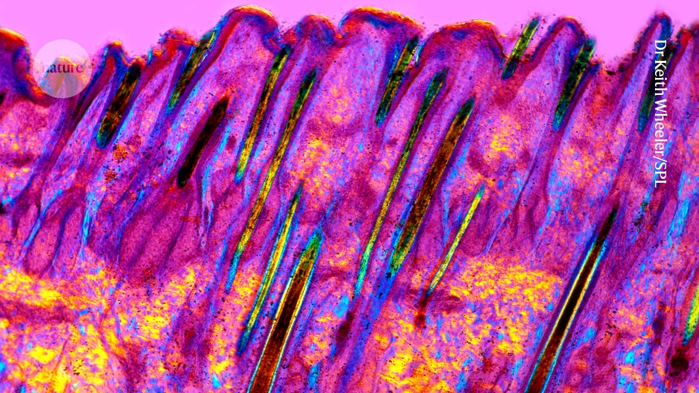

## Summary
The dietary craze of intermittent fasting slows hair regrowth in both humans and mice, experiments show.

## Key Details
- **Source:** [nature.com](https://www.nature.com/articles/d41586-024-04084-9)
- **Title:** Fasting can reduce weight — but also hair growth
- **Description:** The dietary craze of intermittent fasting slows hair regrowth in both humans and mice, experiments show.

## Visual Assets

