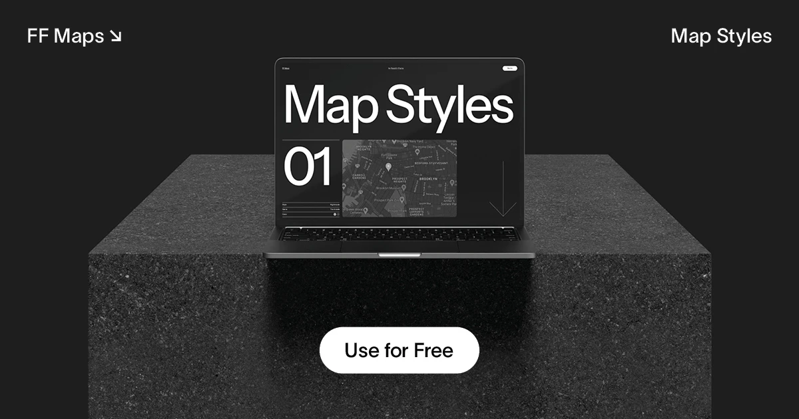

## Summary
Map Styles for Framer – Customize the Google Maps component in Framer without code. Featuring nine handcrafted looks to spice up your maps.

## Key Details
- **Source:** [ff-maps.framer.website](https://ff-maps.framer.website/)
- **Title:** FF Maps – Free Map Styles
- **Description:** Map Styles for Framer – Customize the Google Maps component in Framer without code. Featuring nine handcrafted looks to spice up your maps.

## Visual Assets

