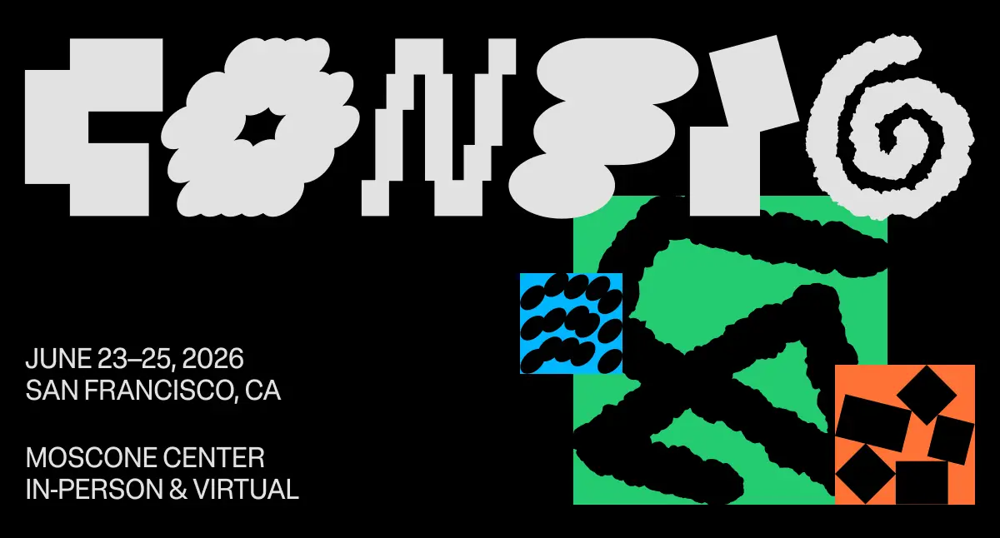

## Summary
Config 2026: Figma’s conference for people who build products

## Key Details
- **Source:** [config.figma.com](https://config.figma.com/?lang=en)
- **Title:** Figma Config 2026 | June 23-25 - Moscone Center SF
- **Description:** Config 2026: Figma’s conference for people who build products

## Visual Assets

