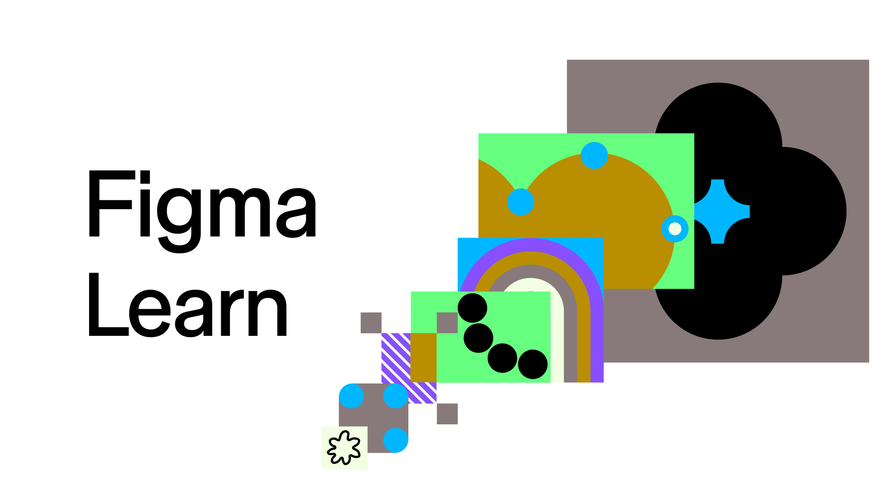

## Summary
Saved from help.figma.com: Figma Learn - Help Center

## Key Details
- **Source:** [help.figma.com](https://help.figma.com/hc/en-us)
- **Title:** Figma Learn - Help Center

## Visual Assets

