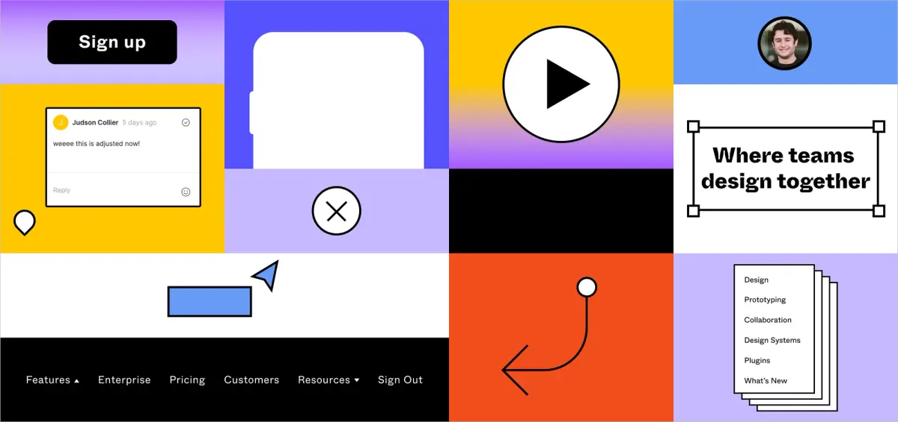

## Summary
A look at how the Figma marketing team built, and continues to build, the design system for figma.com

## Key Details
- **Source:** [figma.com](https://www.figma.com/blog/figma-on-figma-how-we-built-figma-dot-coms-design-system/?utm_source=figma&utm_medium=email&utm_campaign=figma_monthly_march&utm_content=website_design_system_button&mkt_tok=eyJpIjoiWVRVM01ESmpOV05rTUdReCIsInQiOiIyMHg0VHVwSkxPNmVFK05zN3VTcm1lNEdMM3RZYU9hTlYrS3BnUHhOVWREU21sK1wvK2hGWnhmSURnXC9UdHRjXC80NUVBV3NMZkRJMDFId2VXWlc3UFNrZkxScndpa1BcL1BockV2RkF1dzZ5WU5LV08zZUE1KzJSUXFWS0drWEUwM0wifQ%3D%3D)
- **Title:** Figma on Figma: How we built our website design system  | Figma Blog
- **Description:** A look at how the Figma marketing team built, and continues to build, the design system for figma.com

## Visual Assets

