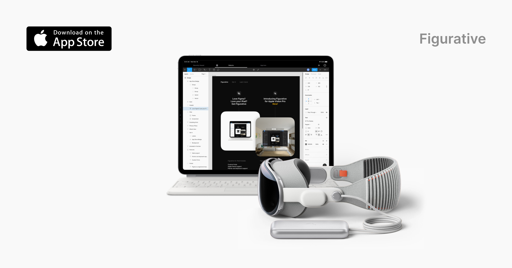

## Summary
Figurative brings the desktop-class editor experience from Figma to iPadOS and visionOS—ready to work with a Magic Keyboard, a trackpad, or a mouse.

## Key Details
- **Source:** [figurative.design](https://figurative.design/)
- **Title:** Figurative – Run Figma on iPad and Apple Vision Pro
- **Description:** Figurative brings the desktop-class editor experience from Figma to iPadOS and visionOS—ready to work with a Magic Keyboard, a trackpad, or a mouse.

## Visual Assets

