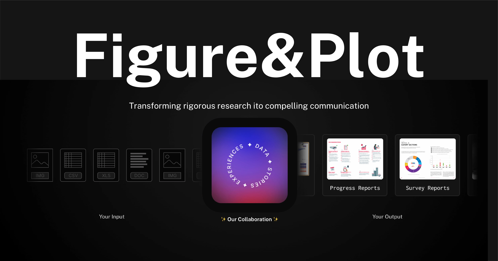

## Summary
Transforming rigorous research into compellng communication, through data, stories and experiences.

## Key Details
- **Source:** [figureandplot.com](https://www.figureandplot.com/)
- **Title:** Figure&Plot
- **Description:** Transforming rigorous research into compellng communication, through data, stories and experiences.

## Visual Assets

