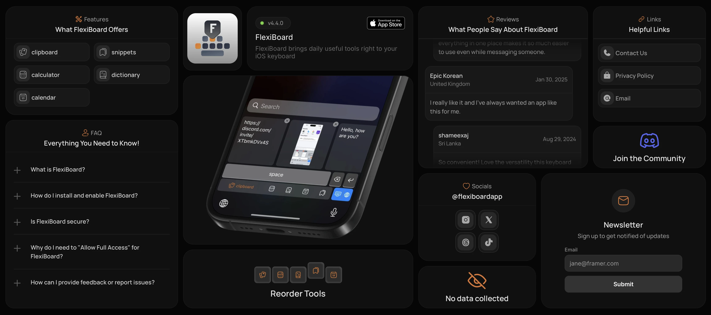

## Summary
Boost your productivity with FlexiBoard! Our iPhone app features a powerful clipboard manager, calculator, dictionary, bookmarks, and a calendar view straight from your mobile keyboard. Perfect for pr

## Key Details
- **Source:** [flexiboardapp.framer.website](https://flexiboardapp.framer.website/)
- **Title:** FlexiBoard - Keyboard Shortcuts
- **Description:** Boost your productivity with FlexiBoard! Our iPhone app features a powerful clipboard manager, calculator, dictionary, bookmarks, and a calendar view 

## Visual Assets

