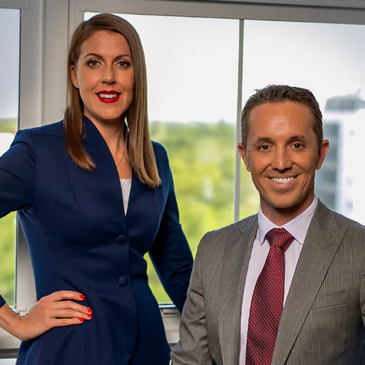

## Summary
Litigating personal injury cases against insurance companies can be frustrating. Overcome their endless coverage denials, bad-faith claims handling, and contentious liability, causation, and damages d

## Key Details
- **Source:** [catheymiles.com](https://catheymiles.com/)
- **Title:** Florida Personal Injury Attorneys - CATHEY & MILES TRIAL LAWYERS
- **Description:** Litigating personal injury cases against insurance companies can be frustrating. Overcome their endless coverage denials, bad-faith claims handling, a

## Visual Assets

