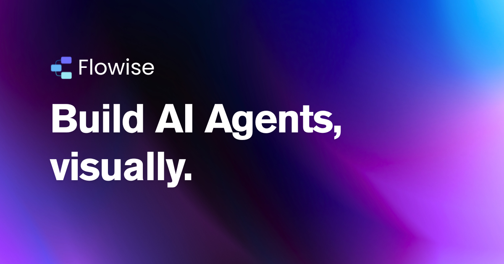

## Summary
Open source generative AI development platform for building AI agents, LLM orchestration, and more

## Key Details
- **Source:** [flowiseai.com](https://flowiseai.com/)
- **Title:** Flowise - Build AI Agents, Visually
- **Description:** Open source generative AI development platform for building AI agents, LLM orchestration, and more

## Visual Assets

