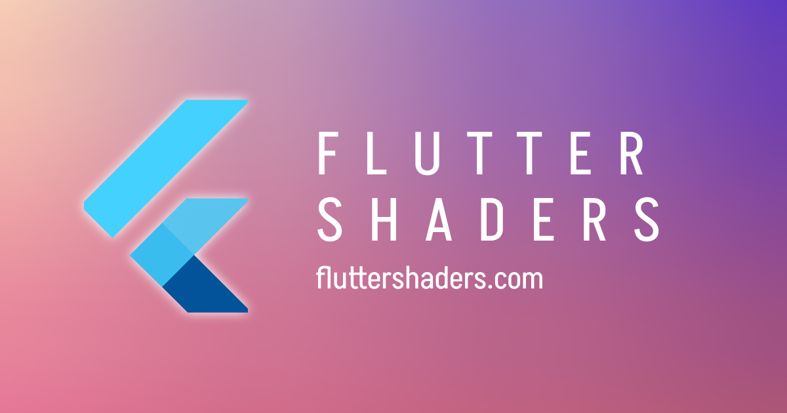

## Summary
An inventory of shaders for Flutter developers to explore.

## Key Details
- **Source:** [fluttershaders.com](https://fluttershaders.com/)
- **Title:** Flutter Shaders
- **Description:** An inventory of shaders for Flutter developers to explore.

## Visual Assets

