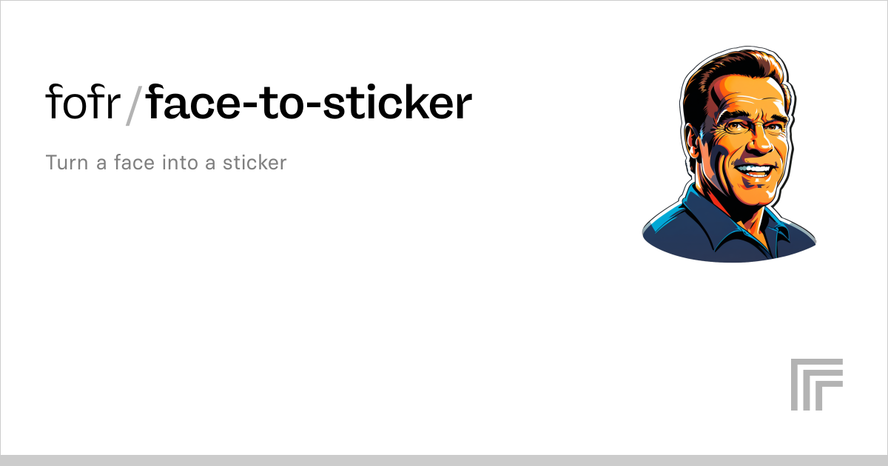

## Summary
Turn a face into a sticker

## Key Details
- **Source:** [replicate.com](https://replicate.com/fofr/face-to-sticker)
- **Title:** fofr/face-to-sticker | Run with an API on Replicate
- **Description:** Turn a face into a sticker

## Visual Assets

