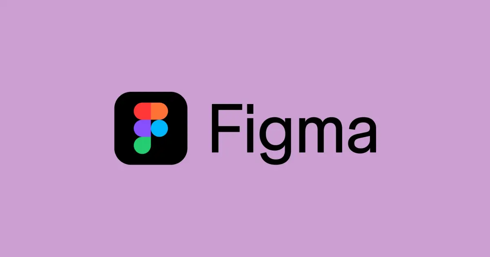

## Summary
Explore our font generator & library. Browse, preview, and use free fonts in Figma instantly.

## Key Details
- **Source:** [figma.com](https://www.figma.com/fonts/)
- **Title:** Font Generator & Free Font Library | Figma
- **Description:** Explore our font generator & library. Browse, preview, and use free fonts in Figma instantly.

## Visual Assets

